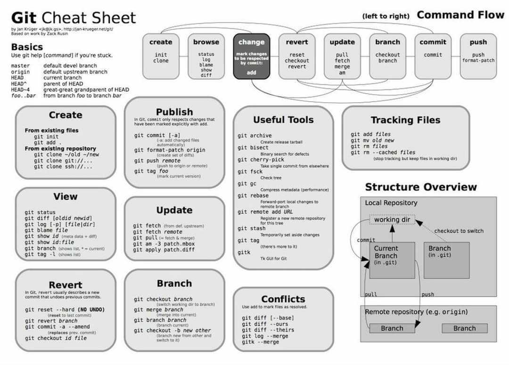
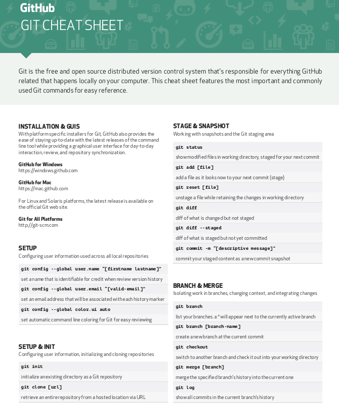
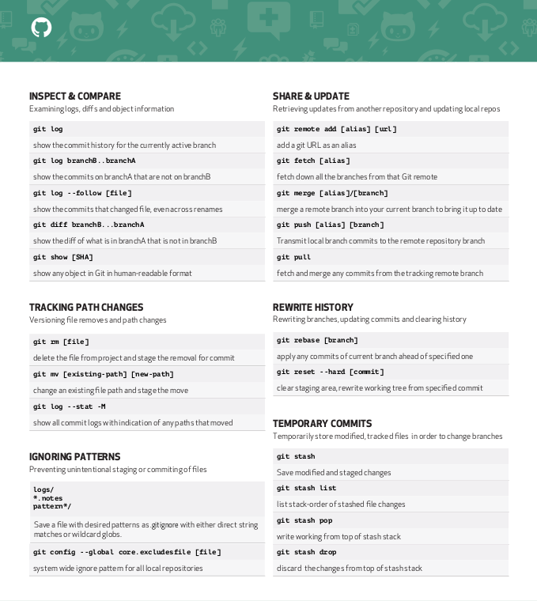

# Common-Git-Hacks
This repository is used for hacking common commands used in Git.



To see branches that you are working or have worked locally on your pc.
```
git branch
```
To see remote branches that others are working or all have worked remotely from repository. (Press 'enter' to see more and 'q' to exit)
```
git branch -r
```
To see all available branches of a repo that you cloned or worked on locally or remotely. (Press 'enter' to see more and 'q' to exit)
```
git branch -a 
```
To download commits, files, and refs from a remote repository into your local repo.
```
git fetch
```
To fetch and download content from a remote repository and immediately update the local repository to match that content.
```
git pull
```
To let you navigate between the branches created by git branch.
```
git checkout <branch_name>
```
To save your changes to the local repository.
```
git commit
```
To upload local repository content to a remote repository. It's the counterpart to git fetch but whereas fetching imports commits to local branches, pushing exports commits to remote branches.
```
git push
```
To review and read a history of everything that happens to a repository. Generally, the git log is a record of commits.
```
git log
```



